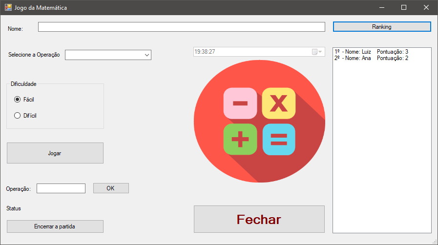

# jogo-matematica
Trabalho proposto pela professora Jaqueline na disciplina de Linguagens de Técnicas de Programação II(4º Período) do Curso de Ciência da Computação, cujo objetivo fora desenvolver um jogo educativo utilizando C# e Windows Forms. Para tal, foi utilizado o Microsoft Visual Studio 2015.

Capturas de tela:

